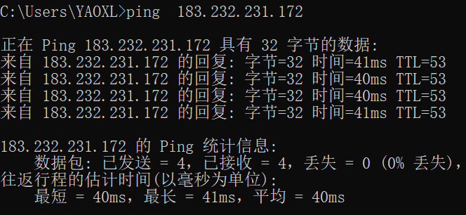
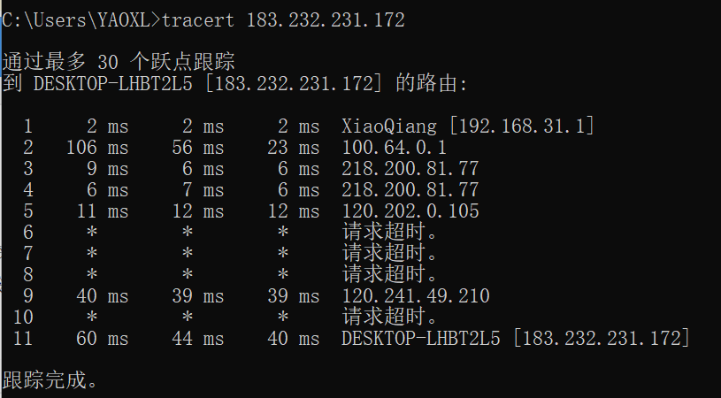

# homework1

## 1. ping 另外一台计算器

`ping 183.232.231.172`



## 2. tracert 一个服务器

`tracert 183.232.231.172`



* **Note:**

  ```
  tracert [-d] [-h maximum_hops] [-j computer-list] [-w timeout] target_name
  ```

  参数介绍：

  * -d 指定不将地址解析为计算机名
  * -h maximum_hops 指定搜索目标的最大跃点数
  * -j host-list 与主机列表一起的松散源路由（仅适用于IPv4），指定沿host-list的稀疏源路由列表序进行转发。host-list是以空格隔开的多个路由器IP地址，最多9个。
  * -w timeout 等待每个回复的超时时间（以毫秒为单位）
  * -R 跟踪往返行程路径（仅适用于 IPv6）
  * -S srcaddr 要使用的源地址（仅适用于 IPv6）
  * -4 强制使用 IPv4
  * -6 强制使用 IPv6
  * target_name 目标计算机的名称

